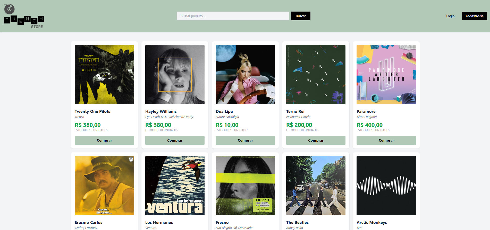
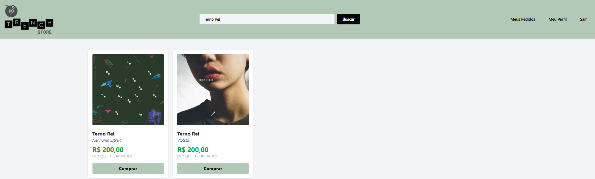
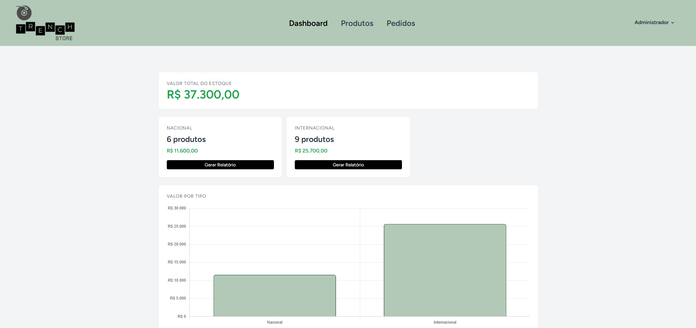

# TRENCH Store

Projeto desenvolvido para a disciplina **Tópicos Especiais em Desenvolvimento de Software I**.

TRENCH Store é uma loja virtual de discos de vinil, desenvolvida com Laravel, com área pública para clientes e área administrativa para gerenciamento de produtos e pedidos.



---

## Tecnologias Utilizadas

- **PHP 8.4** + **Laravel 12**
- **MySQL** (via XAMPP)
- **Tailwind CSS**
- **Alpine.js**
- **Chart.js**
- **Blade Templates**

---

## Funcionalidades

### Área Pública

- Listagem de discos com imagem, artista, álbum, preço e estoque
- Busca de produtos
- Cadastro e login de clientes
- Compra de discos
- Página "Meus Pedidos" para acompanhamento de compras



### Área Administrativa

- Dashboard com valor total do estoque e gráficos por tipo (nacional e internacional)
- Cadastro, edição e exclusão de produtos
- Listagem de todos os pedidos dos clientes
- Geração de relatórios em PDF



### Geral

- Autenticação com redirecionamento por perfil (admin/cliente)
- Upload de imagem de produto
- API JSON de produtos (`/api/products`)

---

## Como Rodar o Projeto

### Pré-requisitos

- PHP 8.4+
- Composer
- Node.js
- XAMPP (Apache + MySQL)

### Instalação

```bash
# Clone o repositório
git clone https://github.com/millenarrosa/lojavirtual.git
cd lojavirtual

# Instale as dependências PHP
composer install

# Instale as dependências JS
npm install

# Copie o arquivo de ambiente
copy .env.example .env

# Gere a chave da aplicação
php artisan key:generate
```

### Configuração do Banco de Dados

1. Abra o XAMPP e inicie o Apache e o MySQL
2. Acesse o phpMyAdmin em `http://localhost/phpmyadmin`
3. Crie um banco de dados chamado `lojavirtual`
4. Configure o `.env`:

```env
DB_CONNECTION=mysql
DB_HOST=127.0.0.1
DB_PORT=3306
DB_DATABASE=lojavirtual
DB_USERNAME=root
DB_PASSWORD=
```

### Finalizando

```bash
# Rode as migrations
php artisan migrate

# Crie o link de storage para imagens
php artisan storage:link

# Compile os assets
npm run build

# Rode o servidor
php artisan serve
```

Acesse em: **http://localhost:8000**

---

## Desenvolvido por **Millena Rosa**
